React as a front end framework has now really matured, and I've been using it to build frontends since 2015 and I haven't looked back. At the moment, it is my choice of front end framework and for good reason! You can build intricate and complex single page applications. 

In this tutorial, we're going to build an ecommerce app with React using only the React context and hooks. React hooks have really added another edge to React, as it means we can avoid adding Redux for non complex applications - more on this later. 

This is an in-depth step-by-step tutorial, so we're going to roll up our sleeves and build a react cart from scratch. So go ahead grab a cup of coffee and let's build an ecommerce cart app!

Note: this tutorial is taken from the course <a href="https://www.udemy.com/course/stripe-masterclass-with-react-node/?couponCode=F1AE8F3CFDCA5F79DCE6" target="_blank">Stripe Masterclass</a>, this is a 9 hour deep dive into the Stripe API.

## Resources needed for the tutorial 

1. <a href="https://github.com/cagarweyne/stripe-masterclass" target="_blank">Completed Front End Github repo</a>

2. <a href="https://github.com/cagarweyne/stripe-masterclass/blob/master/src/assets/ben-white-unsplash.jpg" target="_blank">Hero Image</a>

3. <a href="https://github.com/cagarweyne/stripe-masterclass/blob/master/src/assets/shopping-bag.png" target="_blank">Cart Icon PNG</a>

4. <a href="https://github.com/cagarweyne/stripe-masterclass/blob/master/src/assets/studio-bag.png" target="_blank">Studio Bag for homepage section</a>

5. <a href="https://github.com/cagarweyne/stripe-masterclass/blob/master/src/App.scss" target="_blank">The CSS for the App.scss file</a>

## Basic Setup 

To get started we need to bootstrap a react app, and to do that we'll simply use the brilliant create-react-app (CRA) tool to build for us a react app. If you're not familiar with the create-react-app tool you can read more about it on its dedicated page: https://create-react-app.dev/docs/getting-started/ 

Basically Create React App is a tool (built by the developers at Facebook) that gives you a massive head start when building React apps. It saves you from time-consuming setup and configuration. You simply run one command and Create React App sets up the tools you need to start your React project

CRA uses `npx` to install the latest version. Make sure you have at least npm 5.2 installed, as npx was added with that version. Navigate to a suitable location in your computer and type the following command: 

```
npx create-react-app react-ecommerce
```

This will create the react app for us, once it's finished installing all of the dependencies, simply `cd` into the react-ecommerce dir: 

```
cd react-ecommerce
```

You can use `npm` to install dependencies and run the react application to follow along, but I'll be using yarn instead for the front end React app. 

Yarn works exactly the same way as npm does with some slight differences. If you don't have yarn installed you can do so by following the simple installation steps here: https://classic.yarnpkg.com/en/docs/install/#mac-stable

Like I said you can easily follow along using npm instead of yarn and everything will work the same. Just make sure to replace `yarn` with `npm` in the appropriate places. 

To run the react app, simply type:

```
yarn start
```

This starts the react app, and it should automatically open the webpage at: `http://localhos:3000`  and you should see the default react page:

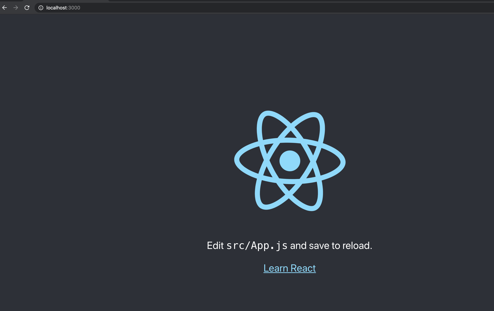

Next, it's time to delete some of the stuff that comes with the CRA tool. So open the `react-ecommerce` directory using your choice of code editor. I'l be using VS code. So I'm going to type code . and this will open the project in VS code for me. 

Navigate to the app.js file that is located inside the `src` directory and inside there replace the contents with this: 

```jsx 
import React from 'react';
import './App.css';

function App() {
  return (
    <div className="App">
      React Ecommerce
    </div>
  );
}

export default App;
```

This deletes some of the boilerplate code that we don't need. We should be left with a simple white page and our text: 'React Ecommerce' on the page when you view it. Go ahead and delete the `App.test.js` file, the test setup and the `logo.svg` file. 

## Remove the strict mode wrapper

Next we need to go inside the `index.js` file and we need to remove the `React.StrictMode` wrapper from the react tree. We need to remove this because we'll be using the hook `useReducer` and when this wrapper is included it will call our action reducers multiple times in development, which we don't want.

So your `index.js` file should look like this: 

```jsx
import React from 'react';
import ReactDOM from 'react-dom';
import './index.css';
import App from './App';
import * as serviceWorker from './serviceWorker';

ReactDOM.render(
    <App />,
  document.getElementById('root')
);

// If you want your app to work offline and load faster, you can change
// unregister() to register() below. Note this comes with some pitfalls.
// Learn more about service workers: https://bit.ly/CRA-PWA
serviceWorker.unregister();
```

## Add Bulma and SASS

To build the ecommerce site we'll use bulma as a css framework. Add the following dependencies:

```
yarn add bulma node-sass
```

This will add bulma and node-sass packages to our app. The great thing about bulma is that we can import only the components that we need. 

Change the `App.css` file to `App.scss`. Then inside this file we'll import the components that we need for our app. 

Your `App.scss` and pase the following code into it: 

```css
@charset "utf-8";

// Import only what you need from Bulma
@import '../node_modules/bulma/sass/utilities/_all.sass';
@import '../node_modules/bulma/sass/elements/button.sass';
@import '../node_modules/bulma/sass/elements/container.sass';
@import '../node_modules/bulma/sass/layout/hero.sass';

.app {
  position: relative;
  min-height: 100vh;
}

img {
  width: 100%;
}

.nomad-container {
  width: 60%;
  margin: 0 auto;
}

#shop-now {
  font-weight: 600; 
  &:hover {
    background-color: #606060;
  }
}

// Featured products section
.featured-collection {
  margin-top: 6rem;

  .featured-section-title {
    font-size: 2rem;
  }

  .featured-image {
    cursor: pointer;
  }

  @media(min-width: 1024px) {
    .products {
      display: flex;
      justify-content: space-between;
      padding: 5px;

      .featured-product {
        margin: 10px;
      }
    }
  }
}

// single product page 
.name-price {
  p {
    font-size: 1.2rem;
    font-weight: bold;
  }

  h3 {
    font-size: 1rem;
  }
}

//black button styles
.nomad-btn {
  display: block;
  width: 100%;
  line-height: 1.4;
  padding-left: 5px;
  padding-right: 5px;
  white-space: normal;
  margin-top: 0;
  margin-bottom: 10px;
  min-height: 44px;
}

//input styles
.nomad-input {
  width: 100%;
  padding: 10px;
  margin-bottom: 1rem;
}

form {
  padding: 2rem;
  text-align: center;
  input[type=text],
  input[type=email],
  input[type=password]{
    width: 60%;
  }

  .submit-btn {
    display: flex;
    justify-content: center;
  }

  .submit {
    width: 200px;
  }
}

.form-error {
  border: 1px solid red;
}

::placeholder {
  color: #606060;
  font-size: 16px;
}

#btn-white-outline {
  border: 1px solid grey;
  margin-bottom: 1rem;
}
#buy-it-now-btn {
  &:hover {
    background-color: #606060;
  }
}

@media(min-width: 1024px) {
  form {
    width: 80%;
    margin: 0 auto;

    input[type=text],
    input[type=email],
    input[type=password]{
      width: 65%;
    } 
  }
}
```

For the index.css file add the following: 

```css
html, body {
  position: relative;
  height: 100%;
}
body {
  margin: 0;
  font-family:  "Nunito Sans",;
  -webkit-font-smoothing: antialiased;
  -moz-osx-font-smoothing: grayscale;
}

#root {
  position: relative;
  min-height: 100vh;
}

.app {
  padding-bottom: 20rem !important;
}

.nomad-footer {
  position: absolute;
  bottom: 0;
  width: 100%;
  height: 20rem !important;
}

code {
  font-family: source-code-pro, Menlo, Monaco, Consolas, 'Courier New',
    monospace;
}
```

We're obviously not going to be focussing on the CSS, so I'll be giving you the css code as we go along. Feel free to remove, add or customize as you wish.

## Header section 

We're now going to start building the Ecommerce home page. We'll start with the Header section. First we need to create a `components` folder, this is where we'll put all of our components that we'll create. Put this inside the `src` folder. 

Now inside the components folder, create a header folder inside it. Then inside that folder create a `header.jsx` and `header.styles.scss`. 

Going forward we'll create a folder for each component that will house the component jsx file and all of the other related files such as the styles and any child components. 

We're going for a minimal header and nothing fancy, so we're simply going to have a logo, menu items and the cart icon in the header.

First we need to add another dependency for routing, so we're going to add `react-router-dom`: 

```
yarn add react-router-dom
```

We need to add some basic router config inside the `index.js` file. We're going to import `BrowserRouter` and then we'll wrap our `App` component: 

```jsx
import React from 'react';
// highlight-next-line
import ReactDOM from 'react-dom';
import { BrowserRouter } from 'react-router-dom';
import './index.css';
import App from './App';
import * as serviceWorker from './serviceWorker';

ReactDOM.render(
   // highlight-start
  <BrowserRouter>
   <App />
  </BrowserRouter>,
  // highlight-end
  document.getElementById('root')
);

// If you want your app to work offline and load faster, you can change
// unregister() to register() below. Note this comes with some pitfalls.
// Learn more about service workers: https://bit.ly/CRA-PWA
serviceWorker.unregister();
```

Now inside the header component, we're going to create a nav menu and two links to start with: 

```jsx
import React from 'react';
import { Link } from 'react-router-dom';

import './header.styles.scss';

const Header = () => {
  return (
    <nav className="nav-menu container">
      <div className='logo'>
        <Link to='/'>NOMAD</Link>
      </div>
      <ul className='links'>
        <li>
          <Link 
            to='/'
            className="" 
          >
            Home
          </Link>
        </li>
        <li>
          <Link
            to='/shop' 
            className=" " 
          >
            Shop
          </Link>
        </li>
      </ul>
    </nav>
  );
}

export default Header; 
```

For the styles, we're also keeping it simple. Add the following to `header.styles.scss`:

```css
.nav-menu {
  display: flex;
  padding: 1rem;

  a {
    text-decoration: none;
    &:focus, &:hover, &:visited {
      color: black;
    }
  }

  .logo {
    font-size: 1.5rem;
  }
  ul {
    list-style: none;
    margin: 0;
    margin-left: auto;
    li {
      display: inline-block;
      margin: 0 1rem;
    }
  }
}
```

Now navigate to `App.js` and import the Header component: 

```jsx
import React from 'react';
// highlight-next-line
import Header from './components/header/header';
import './App.scss';

function App() {
  return (
    <div className="App">
      <Header />
    </div>
  );
}

export default App;
```

This gives us a basic nav menu: 

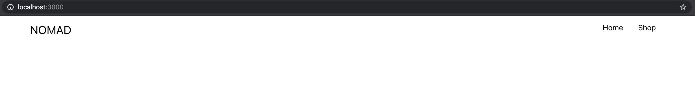

### Cart Icon

We're going to now create the cart icon, and for that we'll create its own cart folder inside the components directory. Then we'll create two files, `cart-icon.jsx` and `cart-icon.styles.scss`. 

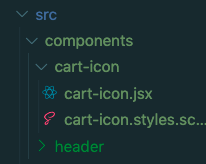

As for the cart icon we'll use a shopping bag icon and we'll set that as a source for the image tag. I linked to the cart image at the beginning of the tutorial, just download it from the link above, if you haven't already. 

In our React app, we'll create an assets folder that will house all our assets that we'll be using on our app. So inside the `src` folder create an assets folder and place `shopping-bag.png` file inside there. 

We're going to place the amount in the cart next to it and for that we can use some simple css. Copy this css and put it inside the `cart-icon.styles.scss` file: 

```css
.cart-container {
  margin-left: auto;
  cursor: pointer;
  img {
    width: 30px;
  }
  .cart-count {
    margin-left: -10px;
    background-color: black;
    color: white;
    padding-right: 4px;
    border-radius: 10px;
  }
}
```

As for the cart icon component, we're going to use an image tag and the span element to hold the cart item count: 

```jsx 
import React from 'react';
import shoppingBag from '../../assets/shopping-bag.png';
import './cart-icon.styles.scss';

const CartIcon = ({ history }) => {
  return (
    <div className="cart-container" onClick={() => history.push('/cart')}>
      
      <span className='cart-count' id='lblCartCount'> 5 </span>      
    </div>
  );
}

export default CartIcon; 
```

Now in order to see our icon we need to go into the header component and import our cart icon and add it to the returned jsx after the `ul` element: 

```jsx
import React from 'react';
import { Link } from 'react-router-dom';
import CartIcon from '../cart-icon/cart-icon';
import './header.styles.scss';

const Header = () => {
  return (
    <nav className="nav-menu container">
      <div className='logo'>
        <Link to='/'>NOMAD</Link>
      </div>
      <ul className='links'>
          ....
      </ul>
      // highlight-next-line
      <CartIcon />
    </nav>
  );
}

export default Header; 
```

This now gives us our header with a cart icon:

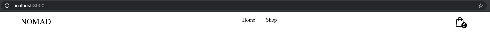

For the time being we have hard coded the cart amount, we'll be coming back to this later and wiring it up with actual cart items that the user adds. 

## Hero section

The next part of our build is to create the hero section. This will be a simple large image with text and a call to action button. We're going to use the bulma hero component, and we'll use the large version. 

Inside the components directory create a hero folder and inside that create a `hero.jsx` and a `hero.styles.scss` files: 

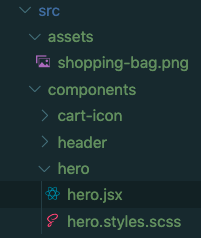

For the image we're using the `ben-white-unsplash.jpg`, again, the links for this is at the beginning of the tutoial. Make sure that's in the assets folder in our react app. We're going to use this image as background for the hero section. Here's the css styles for `hero.styles.scss`: 

```css
.hero-image {
  background: linear-gradient(rgba(0,0,0,0.2),rgba(0,0,0,0.2)),
  url('../../assets/ben-white-unsplash.jpg') center/cover no-repeat;
}

.hero-title {
  text-align: center;
  font-size: 2rem;
}

@media(min-width: 1024px) {
  .hero-title {
    font-size: 2.5rem;
  }
}

.shop-now-btn {
  text-align: center;  
}
```

For the hero component we'll get the hero component from Bulma do the heavy lifting for us as far as the size and placement goes:

```jsx
import React from 'react';
import { withRouter } from 'react-router-dom';
import './hero.styles.scss';

const Hero = ({ history }) => {
  return(
    <section className="hero is-info is-large hero-image">
      <div className="hero-body ">
        <div className="container">
          <h1 className="hero-title">
            Bags reimagined for modern life.
          </h1>
          <div className="shop-now-btn">
            <button className="button is-black" id='shop-now' onClick={() => history.push('/shop')}>SHOP NOW</button>
          </div>
        </div>
      </div>
    </section>
  );
}

export default withRouter(Hero); 
```
So it's a simple component, we're using the `withRouter` higher order component to get history object injected so that we can navigate to the shop page when the user clicks the 'SHOP NOW' button. We haven't created the shop component yet, we'll create that a bit later on. 

Now in order for us to see how our component looks like we need to head over to the `App.js` file and import the hero component and add it to our returned jsx: 

```jsx 
import React from 'react';
import Header from './components/header/header';
import Hero from './components/hero/hero';
import './App.scss';

function App() {
  return (
    <div className="App">
      <Header />
      <Hero />
    </div>
  );
}

export default App;
```

This gives us a nice hero section on the home page: 


## Main section 

We now have a nice header and hero section, we're going to add a main middle section. This part will be split into two sections. The first middle section will have an image with a description of the product plus a call to action button. Then we'll have a featured collection section that will contain four products from the bag collection. 

For this we'll need a main-section folder and inside it we'll create a `main-section.jsx` file along with a `main-section.styles.scss` file: 

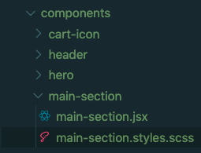

Here are the styles for the main section, including the featured collection:

```css
.main-section-container {
  width: 70%;
  margin: 3rem auto;
  h2 {
    font-size: 1.1rem;
  }

  .ms-m-description {
    p {
      font-size: 0.9333rem;
      line-height: 1.5
    }
  }

  @media(min-width: 1024px) {
    .main-section-middle {
      display: flex;
      justify-content: space-between;
      .ms-m-image {
        max-width: 545px;
        flex: 1 0 545px;
      }
      .ms-m-description {
        margin-left: 30px;
        align-self: center;
        p {
          font-size: 1.1rem;
        }
      }
    }
  }
}
```

The first part in the main section will have an image and a description part along with a button to go to the product page for the bag modeled in the image. Here is our `main-section` component: 

```jsx 
import React from 'react';
import { withRouter } from 'react-router-dom';
import msImageOne from '../../assets/msImageOne.png';
import './main-section.styles.scss';

const MainSection = ({ history }) => {
  return (
    <div className='main-section-container'>
      <div className='main-section-middle'>
        <div className='ms-m-image'>
          
        </div>
        <div className='ms-m-description'>
          <h2>Designed for fashion. Crafted for sport.</h2>
          <p>We make products that effortlessly transition from day to night. 
            From the board room to the fitness studio, and everywhere in between, 
            each Nomads piece is thoughtfully created to be the perfect balance of 
            form and function.</p>
            <button 
            className="button is-black" id='shop-now' onClick={() => history.push('/product/1')}>
              STUDIO BAG
          </button>
        </div> 
      </div>
    </div>
  );
}

export default withRouter(MainSection);
```

The image that we're using is the `msImageOne.png`, again make sure that's in your assets folder. The link that the button points to is the single products page, which we'll be building soon. 

We need to now import the main section into our `App.js` file:

```jsx
import React from 'react';
import Header from './components/header/header';
import Hero from './components/hero/hero';
import MainSection from './components/main-section/main-section';
import './App.scss';

function App() {
  return (
    <div className="App">
      <Header />
      <Hero />
      <MainSection />
    </div>
  );
}

export default App;
```

Our homepage is now nicely taking shape: 

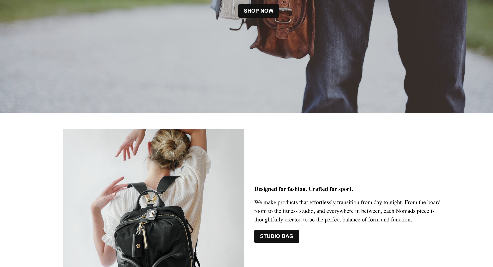


### Featured collection

We're going to now build the featured collection section. This will display four products that are featured on the homepage. Now before we build this component we need to figure out a way of including the product data in our React app. At the moment our React app is isn't connected to a back end API that we can call to get the product data. 

So, what we'll do is to use a an array of products and then load these products into our React app. The React context API is extremely useful, and what we'll do is to use the React context to inject the product data anywhere in our app. 

#### Create React context for products

We already have a file that contains the products we will be showcasing on our app. This is simply an array of objects that contains details about each product such as the item description, it's title, image etc: 

```javascript
[
  {
    id: 1,
    title: 'Studio Bag',
    description: 'The Studio Bag is identical to its predecessor plus a few more inches to love. Transition it from satchel to backpack to crossbody simply by changing straps. Carry it wherever you go - it will be ready to adapt to your needs and keep up with your lifestyle.',
    imageUrl: 'https://i.ibb.co/PcXVJ8m/studiobag.jpg',
    price: 15,
  },
  {
    id: 2,
    title: 'Cumulus',
    description: 'Light as air. The Cumulus is encased in cloud-like waterproof nylon and has a spacious main interior. Collapse it for easy travel and snap it shut with magnetic closures.',
    imageUrl: 'https://i.ibb.co/NtpJ0XQ/cumulus-olive.png',
    price: 28,
  },
];
```

Create a `shop-data` folder in the root of `src` and inside it make sure that the `shop-data.js` is inside it: 

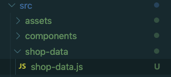

Now in order to make this shop data available we're going to create a context and then set the value to our products array. So, we first need to create a context folder inside the `src` folder, this folder will hold all our contexts in our app. Then inside the context folder create a `products-context.js` file: 

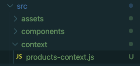

Now inside the `products-context.js` file we're going to import our shop data file that contains the array of product objects and then we'll initialize a new context: 

```jsx
import React, { createContext, useState } from 'react';
import SHOP_DATA from '../shop-data/shop-data';

export const ProductsContext = createContext();

const ProductsContextProvider = ({children}) => {
  const [products] = useState(SHOP_DATA);

  return (
    <ProductsContext.Provider value={{ products }}>
      { children }
    </ProductsContext.Provider>
  );
}

export default ProductsContextProvider;
```

We're also using the `useState` hook here, we could simply just assign the `SHOP_DATA` directly to the value prop in the context. However, in real apps the product data will come from a data store, and when we're ready for that we simply make a call for the data and update that using the `useState` hook. This will in turn put the updated products into the value prop of our products context. 

Now in order to use this context we need to wrap our entire components with the products context. Go into the `src` folder and inside the index.js file wrap the App component: 

```jsx
import React from 'react';
import ReactDOM from 'react-dom';
import { BrowserRouter } from 'react-router-dom';
// highlight-next-line
import ProductsContextProvider from './context/products-context';
import './index.css';
import App from './App';
import * as serviceWorker from './serviceWorker';


ReactDOM.render(
  <BrowserRouter>
  // highlight-next-line
    <ProductsContextProvider>
      <App />
  // highlight-next-line
    </ProductsContextProvider> 
  </BrowserRouter>,
  document.getElementById('root')
);
```

This means that any nested component will be able to reach out to the products context and use the data. Now that we have added a products context in our app, we're going to change gears back to the featured collection component. 

#### Featured collection component

The featured collection component will display four products using the products context. Inside the `main-section` folder in components, we're going to create a `featured-collection.jsx` file: 

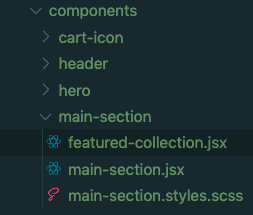

This component will display the featured collection products. 


## Featured product

Thinking ahead, we'll need a component that takes a single product, and displays the product's title, image, and price. We're going to probably reuse this component so we'll create a shared folder inside components and then add a `featured-product.jsx` and a `featured-product.styles.scss` file:

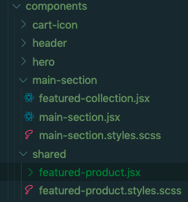

The `featured-product.jsx` component will simply take a single product that is an object and display the image, title and price of that product and along with a button that enables the user to add that product to the cart:

```jsx
import React from 'react';
import './featured-product.styles.scss';

const FeaturedProduct = (product) => {
  const { title, imageUrl, price } = product;
  return (
    <div className='featured-product'>
      <div className='featured-image'>
        
      </div>
      <div className='name-price'>
        <h3>{title}</h3>
        <p>${price}</p>
        <button className='button is-black nomad-btn'>ADD TO CART</button>
      </div>
    </div>
  );
}

export default FeaturedProduct;
```

Here are the styles for the file `featured-product.styles.scss`

```css
.featured-product {
  border: 1px solid rgba(0, 0, 0, 0.125);;
  padding: 1rem;
  margin: 1rem 0;
}
```

Now that we have the featured product component ready, we can continue building out the `FeaturedColection` component: 

```jsx
import React, { useContext } from 'react';
import { ProductsContext } from '../../context/products-context';
import FeaturedProduct from '../shared/featured-product';

const FeaturedCollection = () => {
  const { products } = useContext(ProductsContext);
  const productItems = products.filter((product, i) => i < 4).map(product => (
    <FeaturedProduct {...product} key={product.id} />
  ));
  return (
    <div className='featured-collection container'>
      <h2 className='featured-collection-title'>Featured Collection</h2>
      <div className='products'>
        {
          productItems
        }
      </div>
    </div>
  );
}

export default FeaturedCollection;
```
Let's briefly explain what's happening inside this component. The `FeaturedCollection` component simply displays each of the products using the `FeaturedProduct` child component. 

So in this file we are reaching into the products context using the `useContext` hook and passing in the instance of the `ProductsContext` that we created earlier. This will return for us an array of products objects that we can use. 

Then inside the `FeaturedCollection` we are simply filtering the product items and only returning the first four products, because we only want to display four products in the featured collection section of the home page. 

Then we map over the returned products from the filter function and then pass each product to `FeaturedProduct` and finally display the four products using the `productItems` variable. 

Now that we have the `FeaturedCollection` component we can go back into the `MainSection` component and simply add the `FeaturedCollection` component as a child: 

```jsx 
import React from 'react';
import { withRouter } from 'react-router-dom';
import msImageOne from '../../assets/msImageOne.png';
import FeaturedCollection from './featured-collection';
import './main-section.styles.scss';

const MainSection = ({ history }) => {
  return (
    <div className='main-section-container'>
      <div className='main-section-middle'>
        <div className='ms-m-image'>
          
        </div>
        <div className='ms-m-description'>
          <h2>Designed for fashion. Crafted for sport.</h2>
          <p>We make products that effortlessly transition from day to night. 
            From the board room to the fitness studio, and everywhere in between, 
            each Nomads piece is thoughtfully created to be the perfect balance of 
            form and function.</p>
            <button 
            className="button is-black" id='shop-now' onClick={() => history.push('/product/1')}>
              STUDIO BAG
          </button>
        </div> 
      </div>
      // highlight-next-line
      <FeaturedCollection />
    </div>
  );
}

export default withRouter(MainSection);
```

This completes the main section of the homepage: 


Next we're going to add a simple footer.

## Footer 

We're going to create a footer folder and inside there we'll add a `footer.jsx` and a `footer.styles.scss` file: 

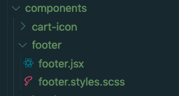

For the footer itself we're just going to have a simple copyright symbol followed by the name of the store: 

```jsx
import React from 'react';
import './footer.styles.scss';

const Footer = () => {
  const year = new Date().getFullYear();
  return(
    <div className='footer'>
      {year} © NOMAD Store
    </div>
  );
}

export default Footer;
```

`footer.styles.scss`: 

```css
.footer {
  width: 50%;
  margin: 4rem auto;
  text-align: center;
}
```

Now we have our Footer component we can use it inside the `App.js` file:

```jsx
import React from 'react';
import Header from './components/header/header';
import Hero from './components/hero/hero';
import MainSection from './components/main-section/main-section';
import Footer from './components/footer/footer';
import './App.scss';

function App() {
  return (
    <div className="App">
      <Header />
      <Hero />
      <MainSection />
      <Footer />
    </div>
  );
}

export default App;
```

This completes the homepage layout for the site. Next we're going to add routes to our React app. If you followed along to this point, your homepage should now look like this: 


If for whatever reason it looks different, you can refer to the finised repo here: <a href="https://github.com/cagarweyne/stripe-masterclass " target="_blank">Finished repo</a>

## Layout & Home page component

We're now going to setup routing in our app. Before we add the routes, we need to create a layout component that will contain the header and footer for our site. 

This component will then wrap any other components that we create and give them a header and footer sections. It will also give us the flexibility to add or remove the header or footer from any future components that we deem do not need this - like a signup or login pages.

We'll simply create a layout component inside the root of the components folder: 

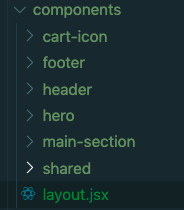

The layout component won't do anything special, it'll just import the header and footer component and return the passed in children props: 

```jsx
import React from 'react';
import Header from './header/header';
import Footer from './Footer/footer';

const Layout = ({children}) => {
  return (
    <>
      <Header />
        <main>
          {
            children
          }
        </main>
      <Footer />
    </>
  );
}

export default Layout;
```

Now we have the Layout component, we can go ahead and create a `Homepage` component that we can render when the user visits the root path. 

like the Layout component we'll add the `Homepage` component to the root of the components folder in app: 

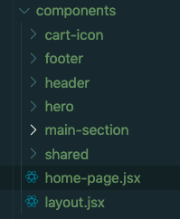

`homepage.jsx`:

```jsx
import React from 'react';
import Layout from './layout'
import Hero from './hero/hero';
import MainSection from './main-section/main-section';

const HomePage = () => {
  return (
    <>
      <Layout>
        <Hero />
        <MainSection />
      </Layout>
    </>
  );
}

export default HomePage;
```
The Homepage component will render the `Layout`, which is the header and the footer and then it'll render the `Hero` and `MainSection` as children. With that out of the way we can now add the routes to our app inside the `App.js` file: 

```jsx
import React from 'react';
import { Switch, Route } from 'react-router-dom';
import HomePage from './components/home-page';
import './App.scss';

function App() {
  return (
    <div className="App">
      <Switch>
        <Route exact path='/' component={HomePage} />
      </Switch>
    </div>
  );
}

export default App;
```

So here we're simply routing to the `Homepage` component when the user visits the root path. This now gives us flexiblity to create more routes. 

## Catch all route and component 

We're going to add another route, which is a catch all route, so if React Router cannot match a particular path to a component it will render this catch all component or 404. 

So in our components folder we'll create a `NotFound.jsx` component. Now inside this component we'll simply return some text to say the requested path could not be found:

```jsx
import React from 'react';
import Layout from './layout';

const NotFound = () => {
  const style = {
    fontWeight: 'bold',
    textAlign: 'center',
  }
  return (
    <Layout>
      <p style={style}>Unfortunately we can't find that page</p>
    </Layout>
  );
}

export default NotFound;
```

Then inside the `App.js` component we'll create a wildcard catch all path and then render the `NotFound` component: 

```jsx
import React from 'react';
import { Switch, Route } from 'react-router-dom';
import HomePage from './components/home-page';
import NotFound from './components/not-found';
import './App.scss';

function App() {
  return (
    <div className="App">
      <Switch>
        <Route exact path='/' component={HomePage} />
        <Route path="*" component={NotFound} />
      </Switch>
    </div>
  );
}

export default App;
```

This completes our route settings for now. We'll come back to this when we create a shop component next. 

## Shop component

Next we're going to create a shop component that will display all of the items that are for sale in the store. We'll create a pages folder inside our components directory, this folder will contain all of the components that will act as pages on our site. Inside the pages folder we'll add our shop component along with its style sass file:

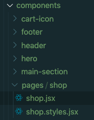

Here is the css for the `shop.styles.scss` file:

```css
.product-list-container {
  margin: 3rem 0;
  .product-list-title {
    margin-top: 5rem;
    text-align: center;
  }

  .products-list {
    
    div {
      margin: 1rem;
      cursor: pointer;
    }
  }
}

@media(min-width: 1024px) {
  .product-list-container {
    .products-list {
      display: flex;
      flex-wrap: wrap;
      justify-content: center;
      align-items: center;
      margin: 0 5rem;
  
      div {
        flex: 0 0 300px;
        
      }
    }
  }
}
```

As for the component, we're going to use the `FeaturedProduct` component to display all of the product items similar to how we displayed the featured collection in the homepage: 


```jsx
import React, { useContext } from 'react';
import Layout from '../../layout';
import FeaturedProduct from '../../shared/featured-product';
import { ProductsContext } from '../../../context/products-context';

import './shop.styles.scss';

const Shop = () => {
  const { products } = useContext(ProductsContext);
  const allProducts = products.map(product => (
    <FeaturedProduct {...product} key={product.id} />
    ));
    
  return (
    <Layout>
      <div className='product-list-container'>
        <h2 className='product-list-title'>Shop</h2>
        <div className='products-list'>
          {
            allProducts
          }
        </div>
      </div>
    </Layout>
  );
}

export default Shop;
```

Now that we have our shop component, we're going to create a route `/shop` for it inside the `App.js` file: 

```jsx
import React from 'react';
import { Switch, Route } from 'react-router-dom';
import HomePage from './components/home-page';
import NotFound from './components/not-found';
import Shop from './components/pages/shop/shop';
import './App.scss';

function App() {
  return (
    <div className="App">
      <Switch>
        <Route exact path='/' component={HomePage} />
        <Route path='/shop' component={Shop} />
        <Route path='*' component={NotFound} />
      </Switch>
    </div>
  );
}

export default App;
```

When the user navigates to the `/shop` route it will show the shop component that displays all of the items available. Now that we have a shop page, all links pointing to the route `/shop` should work. 

The shop page should now look like this: 

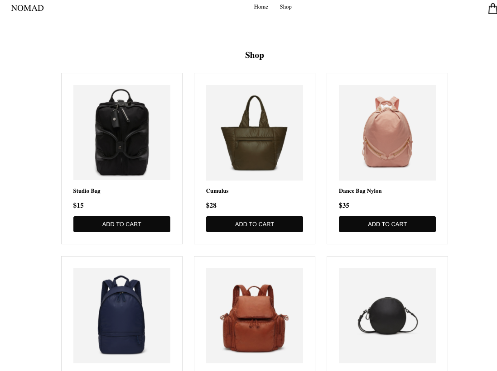

## Single product component

The next component that we need to create to finish off our ecommerce store is the single product view page, that is a page that shows each individual product, description, image and price. For this we'll create a folder `single-product` and inside it we'll have a component single-product and its stylesheet:

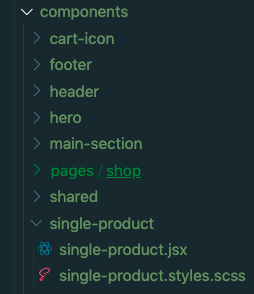

Here are the styles for `single-product.styles.scss`:

```css
.single-product-container {
  margin: 2rem 0;
  margin-bottom: 3rem;
  padding: 2rem;

  @media(min-width: 1024px) {
    display: flex;
    justify-content: center;
    align-items: center;

    .product-image, .product-details {
      flex: 0 0 400px;
    }
  }

  .product-image {
    margin: 2rem;
  }

  .product-details {
    .name-price {
      margin: 1rem 0;
    }  
    .add-to-cart-btns {
      margin: 2rem 0;
    }
  
    .product-description {
      p {
        line-height: 1.5;
      }
    }
  }
}
```

For the single product component we want to get the product id from the url, and if the product id matches any of the products that we have then we'll display that product. For that we'll need to hook into the product context and get all of the products and then use the `useEffect` hook to search our products array:

```jsx
import React, { useState, useEffect, useContext } from 'react';
import { withRouter } from 'react-router-dom';
import { ProductsContext } from '../../context/products-context';
import Layout from '../layout';
import './single-product.styles.scss';

const SingleProduct = ({ match, history }) => {
  const { push } = history;
  const { products } = useContext(ProductsContext);
  const { id }= match.params;
  const [product, setProduct] = useState(null);
  useEffect(() => {
    // check to see if the id from the route param matches a product
    const product = products.find((item) => Number(item.id) === Number(id));
    
    // if the product does not exist, we redirect back to the shop
    if (!product) { 
      return push('/shop') 
    }
    // set the product as the state
    setProduct(product);
  }, [product, push, id, products]);

  // before using the product, we need to momentarily return null,
  // because the product will be null for a split second - in that time we'll
  // just return null - we could add a spinner here instead
  // highlight-next-line 
  if (!product) { return null }
  // pull off the props from product
  const { imageUrl, title, price, description } = product;
  return (
    <Layout>
      <div className='single-product-container'>
        <div className='product-image'>
          
        </div>
        <div className='product-details'>
          <div className='name-price'>
            <h3>{title}</h3>
            <p>${price}</p>
          </div>
          <div className='add-to-cart-btns'>
            <button 
              className="button is-white nomad-btn" 
              id='btn-white-outline'>
              ADD TO CART
            </button>
            <button 
              className="button is-black nomad-btn" 
              id='buy-it-now-btn' 
              onClick={() => history.push('/cart')}>
              PROCEED TO CHECKOUT
            </button>
          </div>
          <div className='product-description'>
            <p>
              {description}
            </p>
          </div>
        </div>
      </div>
    </Layout>
  );
}

export default withRouter(SingleProduct);
```

If we find a product we'll set that as the product in the state and display it, else if we don't find a product we'll simply redirect back to the shop page. 

Also, the `useEffect` runs when the component mounts, at this point we don't yet have a product, so we return null (the highlighted line) until it runs. This helps avoid a situation where `product=null` momentarily. 

The single product component contains a button that allows you to add it to the cart. At the moment our cart functionality is not yet implemented, but when this is working it will add the product to the cart.

Now we need to setup a route for a single product and set a route param of id, which wil be the id of a product: 

```jsx
import React from 'react';
import { Switch, Route } from 'react-router-dom';
import HomePage from './components/home-page';
import NotFound from './components/not-found';
import Shop from './components/pages/shop/shop';
// highlight-next-line 
import SingleProduct from './components/single-product/single-product';
import './App.scss';

function App() {
  return (
    <div className="App">
      <Switch>
        <Route exact path='/' component={HomePage} />
        <Route path='/shop' component={Shop} />
        // highlight-next-line 
        <Route path='/product/:id' component={SingleProduct} />
        <Route path='*' component={NotFound} />
      </Switch>
    </div>
  );
}

export default App;
```

Now that we have the product route, we need to go into the `FeaturedProduct` component and inside there we need to add an onClick handler on the image container to redirect to the single product page using the product id:

```jsx
import React from 'react';
import { withRouter } from 'react-router-dom';
import './featured-product.styles.scss';

const FeaturedProduct = (props) => {
  const { title, imageUrl, price, id, history } = props;
  return (
    <div className='featured-product'>
      // highlight-next-line 
      <div className='featured-image' onClick={() => history.push(`/product/${id}`)}>
        
      </div>
      <div className='name-price'>
        <h3>{title}</h3>
        <p>${price}</p>
        <button className='button is-black nomad-btn'>ADD TO CART</button>
      </div>
    </div>
  );
}

export default withRouter(FeaturedProduct);
```

This completes our store setup. This is how the single product page should look:

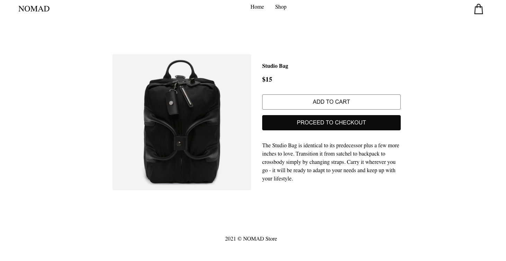

Now we can start working on implementing the cart functionality. 

## Cart functionality 

We're going to start working on the most interesting part of our ecommerce app, and that is to make the cart functional. In terms of deciding how to implement a functional cart, we might think about adding Redux to our app. 

If you've worked on complex applications with React, you will know that the less tools that you add to achieve your goal the better. Adding Redux to the app adds another layer of complexity, so it's always important to think carefullly about whether you need to add Redux to your app. 

So you should ask yourself, what data will Redux state help make easier to access throughout your app? Can you still achieve the same result without adding Redux? Is it possible to use React context instead of using Redux? 

Thinking about your app architecure like this will reduce technical debt later on, this will help you to easily scale up and add more feautures without having to do major refactoring or re-write. 

As for our cart, we're not going to use Redux, mainly because we can achieve the same result without it. That is we can use React context and React Hooks, in particular the `useReducer` hook. If you are very familiar with Redux, you will find that it follows the same principles as Redux, and at times you might actually think you are using Redux. 

### Create a cart context 

We're going to create a cart context, this context will contain our cart items, the number of items the user has selected and the total amount. We will also be adding functions to add more items and update the quantity. 

Inside the context folder create a new file `cart-context.js`. This file will contain our cart context, after creating this file create another file called `cart-reducer.js`. So you should have these two files inside the context folder: 

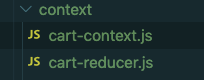

Now inside the `cart-context.js` file we're going to instantiate and export a new context by using the `createContext` function from react: 

```javascript
import React, { createContext } from 'react';

export const CartContext = createContext();
```

We need to export the context, because later on when we use the `useContext` hook we need to pass the context that we wish to get data from. So, it's important to export the context. 

Next we need to create some initial state for our cart items. We're going to pass this inital state to the `useReducer` hook, it needs to be an object. So we're going to create a variable `initialState` and we're going to set it to an object that contains the cart items, total count and the overall total amount - `cart-context.js`: 

```javascript
import React, { createContext } from 'react';

export const CartContext = createContext();

const initialState = { cartItems: [], itemCount: 0, total: 0 };
```

Now that we have the initial state, we need to create a reducer function that will take actions and update the state. Very much similar to Redux. So, go into the `cart-reducer` file and inside there we're going to create a reducer function for the cart: 

```javascript
const cartReducer = (state, action) => {
  switch(action.type) {
    default: 
      return state;
  }
}

export default cartReducer;
```

Let's switch back to the `cart-context.js` file and import `cartReducer` and the `userReducer` hook from react and create a new component `CartContextProvider`: 

```jsx
import React, { createContext, useReducer } from 'react';
import cartReducer from './cart-reducer';

export const CartContext = createContext();

const initialState = { cartItems: [], itemCount: 0, total: 0 };

const CartContextProvider = ({ children }) => {
  const [state, dispatch] = useReducer(cartReducer, initialState);

  const contextValues = {
    ...state,
  }

  return (
    <CartContext.Provider value={contextValues}>
      { children }
    </CartContext.Provider>
  );
}

export default CartContextProvider;
```

So here we've created a new context, and we're using the `useReducer` hook and passing it the `cartReducer` function that we created inside the `cart-reducer.js` file. 

As a second parameter to the `useReducer` hook we pass the initial state that we created using the `initiaState` const variable. The `useReducer` hook returns a state variable and a dispatch function that we're going to later on use to update the state with an action creator.

Then we simply create `contextValues` object that we spread out the contents of the state. So this will return an object like this: 

```javascript
{
  cartItems: [],
  itemCount: 0,
  total: 0,
}
```

This object is then assigned as the object for the value prop on `CartContext.Provider`, which means that it will be made available to any nested component in our app. 

Now to make this context available we need to wrap our root component `App` inside `index.js` like this: 

```jsx
import React from 'react';
import ReactDOM from 'react-dom';
import { BrowserRouter } from 'react-router-dom';
import ProductsContextProvider from './context/products-context';
// highlight-next-line
import CartContextProvider from './context/cart-context';
import './index.css';
import App from './App';
import * as serviceWorker from './serviceWorker';


ReactDOM.render(
  <BrowserRouter>
    <ProductsContextProvider>
    // highlight-next-line
      <CartContextProvider>
        <App />
      </CartContextProvider>
      // highlight-next-line
    </ProductsContextProvider> 
  </BrowserRouter>,
  document.getElementById('root')
);
```


This exposes our cart context to all component inside our app. 

## Use the itemCount from the cart context

We're going to use this context right away. Go to the `cart-icon.jsx` component inside the components folder. Currently we've hardcoded the item count inside this component, so we need to update this to use the `itemCount` value from the context: 

```jsx
import React, { useContext } from 'react';
import { withRouter } from 'react-router-dom';
import { CartContext } from '../../context/cart-context';
import shoppingBag from '../../assets/shopping-bag.png';
import './cart-icon.styles.scss';

const CartIcon = ({ history }) => {
  // highlight-next-line
  const { itemCount } = useContext(CartContext);
  return (
    <div className="cart-container"onClick={() => history.push('/cart')}>
      
       
      {
        // highlight-next-line
        itemCount > 0 ? <span className='cart-count' id='lblCartCount'> { itemCount } </span> : null
      }
      
    </div>
  );
}

export default withRouter(CartIcon); 
```

We're now using the `itemCount` from the cart context. So, we're importing the context that we created and then passing that as the context we want to use to `useContext` hook. We're pulling off the `itemCount` property from the value prop in the context. 

Then inside the jsx, we're doing a check to see if the `itemCount` is greater than 0, if it is we return the count span along with the items count. So, currently, the itemCount is set to 0, this means that the count won't be displaying next to the cart icon. 


### Add items to cart

Now that we have the cart context and we are able to use the `itemCount` to show the number of items the user has added to their cart, we want to be able to add items to our cart. 

For that we needed to add a `addProduct` function that we pass down from the context. This function will use the `dispatch` method that comes from the `useReducer` hook to return an action. This is simply an object that includes the action type and the payload: 

```jsx
import React, { createContext, useReducer } from 'react';
import cartReducer from './cart-reducer';

export const CartContext = createContext();

const initialState = { cartItems: [], itemCount: 0, total: 0 };

const CartContextProvider = ({ children }) => {
  const [state, dispatch] = useReducer(cartReducer, initialState);
  // highlight-next-line
  const addProduct = payload => {
    dispatch({type: 'ADD_ITEM', payload});
  }

  const contextValues = {
    ...state,
    // highlight-next-line
    addProduct,
  }

  return (
    <CartContext.Provider value={contextValues}>
      { children }
    </CartContext.Provider>
  );
}

export default CartContextProvider;
```

The `addProduct` function will be added to the values in the context, this means that anywhere we consume the cart context we will have access to the `addProduct` function as well. The `addProduct` function takes one parameter that is the product object. This is what is dispatched and passed onto the cart reducer. 

Before we can actually use this function, we need to update the state in the cart reducer. So when the user adds a product, that product, which will be an object is passed to the cart reducer. Now inside the cart reducer, we'll listen for an action type that equals `'ADD_ITEM'`, when this is the action that is dispatched we will update the state: 

```jsx
const cartReducer = (state, action) => {
  switch(action.type) {
    case 'ADD_ITEM':
      // check if item is in cart already
      if(!state.cartItems.find(item => item.id === action.payload.id)) {
        // add item to cartItems in current state
        state.cartItems.push({
          ...action.payload,
          quantity: 1,
        }); 
      }
      // return new state
      return {
        ...state,
        cartItems: [...state.cartItems],
        itemCount: state.cartItems.reduce((total, product) => total + product.quantity, 0),
        total: state.cartItems.reduce((total, product) => total + product.price * product.quantity, 0,
      }
    default: 
      return state;
  }
}

export default cartReducer;
```

We're now updating the state when the user adds a new product to the cart items. So whenever `addProduct` is invoked, the case block for `ADD_ITEM` is executed, as this is the action type associated with adding a product. 

We first do a check to see if the item is not already in cart. We do this check, because if the item is already there we don't want to add a duplicate item in the cart. If the item is not already in the cart, we update the cart items in the state by pushing that product into the cartItems array. 

So we've mutated the state, at this point we haven't actually returned new state yet. Then outside the `if` block we spread out the contents of the state and also update the `cartItems`, `itemCount` and the `total`. 

To update the `itemCount` and `total` we're iterating over the `cartItems` and adding up the quantity and price of each product respectively. This will give us the number of items the user has in the cart and the total amount. 

## Create a isIncart helper function

The next step is to use the `addProduct` and for this function to be called when the user adds a product to their cart. We will need to use this inside the `FeaturedProduct` and the `SingleProduct` components. These are the two places where th user is given a button to add a product to the cart.

Let's start with the `FeaturedProduct`. Before updating this component, we need a helper function that will check to see if the current product is already in the cart. This will help us to determine what to show the user, if the product is not in the cart already, we'll show the `ADD TO CART` button. However, if the product is already in the cart we want to show a button that says `'ADD MORE'` - to increase the quantity of the item in the cart. 

We'll call this function `isInCart` and it simply does a search for the product in the cartItems, if it is there already it returns it otherwise it returns undefined: 

```javascript
export const isInCart = (product, cartItems) => {
  return cartItems.find(item => item.id === product.id);
}
```

We'll add this function to a new file called `helpers.js`, inside here we'll add all of the helper functions that we'll use in our app. So go ahead and create that file inside the `src` folder: 

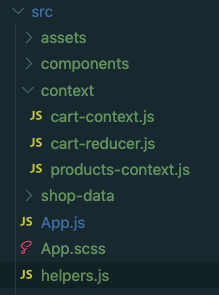

## Use the add product function

Now that we have this function, we can go ahead and update the `FeaturedProduct` component: 

```javascript
import React, { useContext } from 'react';
import { withRouter } from 'react-router-dom';
// highlight-next-line
import { isInCart } from '../../helpers';
import { CartContext } from '../../context/cart-context'; 
import './featured-product.styles.scss';

const FeaturedProduct = (props) => {
  const { title, imageUrl, price, id, description, history } = props;
  const product = { title, imageUrl, price, id, description }
  const { addProduct, cartItems } = useContext(CartContext);
  return (
    <div className='featured-product'>
      <div className='featured-image' onClick={() => history.push(`/product/${id}`)}>
        
      </div>
      <div className='name-price'>
        <h3>{title}</h3>
        <p>${price}</p>
        {
          // highlight-next-line
          !isInCart(product, cartItems) && 
          <button 
            className='button is-black nomad-btn' 
            onClick={() => addProduct(product)}>
              ADD TO CART
          </button>
        }
        {
          // highlight-next-line
          isInCart(product, cartItems) && 
          <button 
            className="button is-white nomad-btn" 
            id='btn-white-outline' 
            onClick={() => {}}>
              ADD MORE
          </button>
        }
        
      </div>
    </div>
  );
}

export default withRouter(FeaturedProduct);
```

Now when we click on the `'ADD TO CART'` button in the shop page or the feaured collection section the product is added to the cart and our item count in the cart icon updates. 

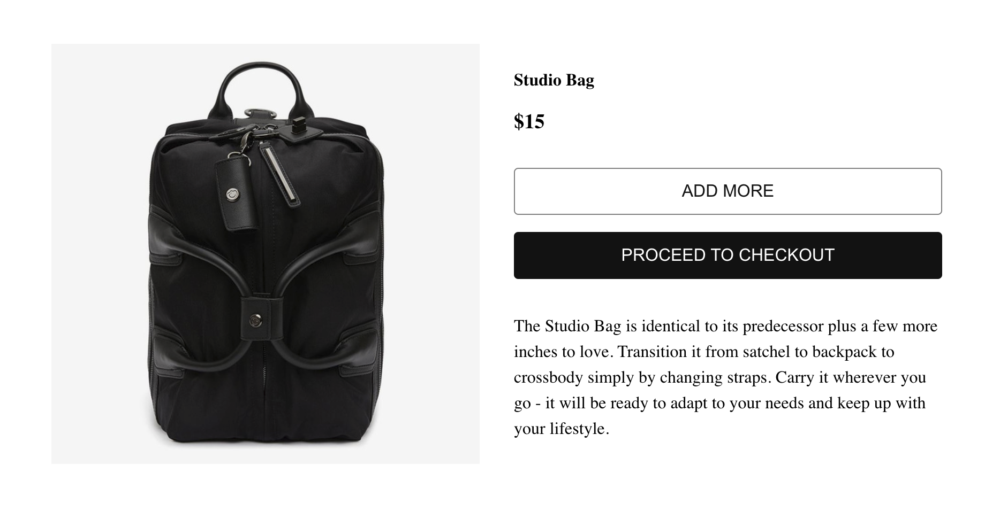

Also, once an item has been added, the button displayed will now change to `'ADD MORE'`. However this is not currently working as we do not have a way to increase the quantity yet. 

Now we need to also wire up the `SingleProduct` component, as in there we also have an 'ADD TO CART' button. Let's update that now: 

```jsx
import React, { useState, useEffect, useContext } from 'react';
import { withRouter } from 'react-router-dom';
import { ProductsContext } from '../../context/products-context';
import { CartContext } from '../../context/cart-context'; 
import Layout from '../layout';
// highlight-next-line
import { isInCart } from '../../helpers';

import './single-product.styles.scss';

const SingleProduct = ({ match, history }) => {
  const { push } = history;
  const { products } = useContext(ProductsContext);
  const { addProduct, cartItems } = useContext(CartContext);
  const { id }= match.params;
  const [product, setProduct] = useState(null);
  useEffect(() => {
    const product = products.find((item) => Number(item.id) === Number(id));
    
    if (!product) { 
      return push('/shop') 
    }

    setProduct(product);
  }, [product, push, id, products]);

  if (!product) { return null }
  const { imageUrl, title, price, description } = product;
  return (
    <Layout>
      <div className='single-product-container'>
        <div className='product-image'>
          
        </div>
        <div className='product-details'>
          <div className='name-price'>
            <h3>{title}</h3>
            <p>${price}</p>
          </div>
          <div className='add-to-cart-btns'>
            {
              // highlight-next-line
              !isInCart(product, cartItems) && 
              <button 
                className="button is-white nomad-btn" 
                id='btn-white-outline' 
                onClick={() => addProduct(product)}
              >
                ADD TO CART
              </button>
            }
            {
              // highlight-next-line
              isInCart(product, cartItems) && 
              <button 
                className="button is-white nomad-btn" 
                id='btn-white-outline' 
                onClick={() => {}}>
                  ADD MORE
              </button>
            }
            
            <button className="button is-black nomad-btn" id='buy-it-now-btn' onClick={() => history.push('/cart')}>
              PROCEED TO CHECKOUT
            </button>
          </div>
          <div className='product-description'>
            <p>
              {description}
            </p>
          </div>
        </div>
      </div>
    </Layout>
  );
}

export default withRouter(SingleProduct);
```

Now inside the single product view, when you click on `'ADD TO CART'` it adds the product to the cart and update the button to display `'ADD MORE'` since we already have the item in the cart. The `'ADD MORE'` functionality is not yet working, we'll tackle this next. 

### Increase item quantity

Now that we are able to add items to the cart, we need to be able to increase the quantity. For this we are going to add another function inside the cart context file and pass this down through the value prop in the cart context. So inside the `cart-context.js` file we're going to add an increase function:

```javascript
import React, { createContext, useReducer } from 'react';
import cartReducer from './cart-reducer';

export const CartContext = createContext();

const initialState = { cartItems: [], itemCount: 0, total: 0 };

const CartContextProvider = ({ children }) => {
  const [state, dispatch] = useReducer(cartReducer, initialState);

  const addProduct = payload => {
    dispatch({type: 'ADD_ITEM', payload});
  }
  // highlight-next-line
  const increase = payload => {
    dispatch({type: 'INCREASE', payload})
  }

  const contextValues = {
    ...state,
    addProduct,
    // highlight-next-line
    increase,
  }

  return (
    <CartContext.Provider value={contextValues}>
      { children }
    </CartContext.Provider>
  );
}

export default CartContextProvider;
```

We need to now update the state in response to the action to increase the quantity. So in our cart reducer function, we add a case for `'INCREASE'`, so when the action type is to increase this block of code is executed: 

```jsx
//highlight-start
export const sumItems = cartItems => {
  return { 
    itemCount: cartItems.reduce((total, product) => total + product.quantity, 0), 
    total: cartItems.reduce((total, product) => total + product.price * product.quantity, 0), 
  }
}
 //highlight-end
const cartReducer = (state, action) => {
  switch(action.type) {
    //...
    //highlight-start
    case 'INCREASE':
    const increaseIndex = state.cartItems.findIndex(item => item.id === action.payload.id);
    state.cartItems[increaseIndex].quantity++;
    return {
        ...state,
        cartItems: [...state.cartItems],
        ...sumItems(state.cartItems),
    }
    default: 
      return state;
  }
  //highlight-end
}

export default cartReducer;
```

Now we've added an update when the user increases the quantity of a product. I've also factored out the `itemCount` and total values function to a separate `sumItems` function that we can call and returns an object with `itemCount` and `total` props on it. We then spread this out into the new state that we are returning.  

Now when we add an item to the cart and then click on `'ADD MORE'` button, the cart is updated with the `itemCount`. We're going to complete the rest of the cart functionality, so we're going to add next decrease, remove, and also a function to clear the cart. 

### Decrease item quantity

The decrease function will do the reverse of increase, so in the cart context, we're going to pass down a `decrease()` function that will return an action creator of type 'DECREASE': 

```javascript
import React, { createContext, useReducer } from 'react';
  //....
  // highlight-next-line
  const decrease = payload => {
    dispatch({type: 'DECREASE', payload});
  }

  const contextValues = {
    ...state,
    addProduct,
    increase,
    // highlight-next-line
    decrease,
  }

  return (
    <CartContext.Provider value={contextValues}>
      { children }
    </CartContext.Provider>
  );
}

export default CartContextProvider;
``` 

Now that we have the decrease function, we're going to update the cart reducer function to update the state when the user clicks on decrease: 

```javascript
export const sumItems = cartItems => {
  return { 
    itemCount: cartItems.reduce((total, product) => total + product.quantity, 0), 
    total: cartItems.reduce((total, product) => total + product.price * product.quantity, 0), 
  }
}

const cartReducer = (state, action) => {
  switch(action.type) {
    //..
    //highlight-start
    case 'DECREASE':
      const decreaseIndex = state.cartItems.findIndex(item => item.id === action.payload.id);
      const product = state.cartItems[decreaseIndex];
      if (product.quantity !== 0 && product.quantity !== 1) {
        product.quantity--;
      }
      return {
          ...state,
          cartItems: [...state.cartItems],
          ...sumItems(state.cartItems),
      }
    default: 
      return state;
  }
  //highlight-end
}

export default cartReducer;
```

The decrease will check to see if the quantity does not already equal 0 or 1. This covers edge cases where the quantity might be equal to 1 already - in this case we don't want to decrement the quantity only present the user with an option to remove the item. 

Also, if the quantity is set to 0 somewhere in the app, we don't want to decrement to a negative value for the quantity. This just us being cautious - and just helps prevent any possible bugs developing later on. 

With the decrease function now added to the cart reducer. We're going to add a remove function that will enable the user to remove an item from the cart. 

### Remove item 

We're going to add a function to remove an item from the cart. So in our cart context we'll add the remove function and dispatch a remove action to the cart reducer: 

```javascript
import React, { createContext, useReducer } from 'react';
import cartReducer from './cart-reducer';

export const CartContext = createContext();

const initialState = { cartItems: [], itemCount: 0, total: 0 };

const CartContextProvider = ({ children }) => {
  const [state, dispatch] = useReducer(cartReducer, initialState);

  //...
  //highlight-start
  const removeProduct = payload => {
    dispatch({type: 'REMOVE_ITEM', payload})
  }
  //highlight-end
  const contextValues = {
    ...state,
    addProduct,
    increase,
    decrease,
    //highlight-next-line
    removeProduct,
  }

  return (
    <CartContext.Provider value={contextValues}>
      { children }
    </CartContext.Provider>
  );
}

export default CartContextProvider;
```

Now inside the cart reducer function we'll simply filter out the removed product from the cart and return the rest of the items as new state: 

```javascript

const cartReducer = (state, action) => {
  switch(action.type) {
    //...
    //highlight-start
    case 'REMOVE_ITEM':
      const newCartItems = state.cartItems.filter(item => item.id !== action.payload.id);
      return {
        ...state,
        cartItems: [...newCartItems],
        ...sumItems(newCartItems),
      };
    default: 
      return state;
  }
  //highlight-end
}

export default cartReducer;
```

This adds the remove functionality to our cart. Next we're going to add a function that will simply clear the cart. 

### Clear cart 

The `clearCart()` function will simply reset everything. Inside the cart context we'll add this function and return a dispatch action of type `'CLEAR'`:

```javascript
import React, { createContext, useReducer } from 'react';
import cartReducer from './cart-reducer';

export const CartContext = createContext();

const initialState = { cartItems: [], itemCount: 0, total: 0 };

const CartContextProvider = ({ children }) => {
  const [state, dispatch] = useReducer(cartReducer, initialState);
  
  //...
  //highlight-start
  const clearCart = () => {
    dispatch({type: 'CLEAR'});
  }
  //highlight-end
  const contextValues = {
    ...state,
    addProduct,
    increase,
    decrease,
    removeProduct,
    //highlight-next-line
    clearCart,
  }

  return (
    <CartContext.Provider value={contextValues}>
      { children }
    </CartContext.Provider>
  );
}

export default CartContextProvider;
```

Now as for the cart reducer, we're simply going to reset all of the cart items to an empty array and reset the `itemCount` and `total` to 0: 

```javascript
export const sumItems = cartItems => {
  return { 
    itemCount: cartItems.reduce((total, product) => total + product.quantity, 0), 
    total: cartItems.reduce((total, product) => total + product.price * product.quantity, 0), 
  }
}

const cartReducer = (state, action) => {
  switch(action.type) {
    //...
    //highlight-start
    case 'CLEAR':
      return {
          cartItems: [],
          itemCount: 0,
          total: 0,
      }    
    default: 
      return state;
  }
  //highlight-end
}

export default cartReducer;   
```

Now this completes the cart functionality. We've already seen that we can add and increase an item quantity in our cart, but we haven't actually used the decrease, remove and clear cart functions of the cart yet. These features will be made available on the cart page. That's the next component we're going to build next. 

### Cart page 

For the cart page we will display each of the items that the user has added to their cart., and also we'll give the user some UI to decrease, remove or clear the entire cart items. For this we're going to create a few components to help us display the items. 

The first thing we need to do is to create a folder inside the pages directory, we'll call it `cart-page` and inside this folder we're going to create a few files - `cart-page.jsx`, `cart-page.styles.scss`, `cart-item.jsx`, and `total.jsx`:  

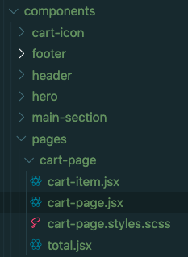

Here are the styles for `cart-page.styles.scss`: 

```css
h1, .empty-cart {
  text-align: center;
}

.cart-page {
  .cart-item {
    text-align: center;
    border: 1px solid #ccc;
    margin: 2rem;
    padding: 1rem;
    .item-image {
      img {
        width: 50px;
      }
    }
    .name-price {
      p {
        font-size: 1rem;
        font-weight: normal;
      }
      h4 {
        margin: 0;
      }
    }
  }

  .total-container {
    margin: 2rem;
    text-align: center;
  }

  .btns-container {
    button {
      border: none;
      padding: 0.5rem 1rem;
      cursor: pointer;
      font-size: 10px;
      margin-right: 5px;      
    }
    .btn-increase {
      color: #fff;
      background-color: #1a1a1a;
      border-color: #1a1a1a;
      appearance: none;
    }
    .btn-decrease, .btn-trash {
      color: #fff;
      background-color: #d9534f;
      border-color: #d9534f;
    }
  }
}

@media(min-width: 1024px) {
  .cart-page {
    display: flex;
    justify-content: center;

    .cart-item {
      display: flex;
      justify-content: space-between;
      div {
        margin: 1rem;
      }
      .name-price {
        width: 200px;
      }
    }

    .total-container {
      text-align: left;
    }
  }  
}
```

We're going to be using some svg icons for the increase, decrease and removing cart items. Inside components folder create an icons directory and inside there add the file `index.js`.

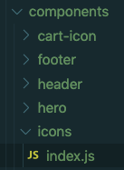

This file will export three functions that display svg icons, and each of them takes the width of the svg as prop: 

```jsx
import React from 'react';

export const MinusCircleIcon = ({width}) => <svg width={width} fill="currentColor" viewBox="0 0 20 20"><path d="M10 18a8 8 0 100-16 8 8 0 000 16zM7 9a1 1 0 000 2h6a1 1 0 100-2H7z" clipRule="evenodd" fillRule="evenodd"></path></svg>

export const PlusCircleIcon = ({width}) => <svg width={width}  fill="currentColor" viewBox="0 0 20 20"><path d="M10 18a8 8 0 100-16 8 8 0 000 16zm1-11a1 1 0 10-2 0v2H7a1 1 0 100 2h2v2a1 1 0 102 0v-2h2a1 1 0 100-2h-2V7z" clipRule="evenodd" fillRule="evenodd"></path></svg>

export const TrashIcon = ({width}) => <svg width={width} fill="currentColor" viewBox="0 0 20 20"><path d="M9 2a1 1 0 00-.894.553L7.382 4H4a1 1 0 000 2v10a2 2 0 002 2h8a2 2 0 002-2V6a1 1 0 100-2h-3.382l-.724-1.447A1 1 0 0011 2H9zM7 8a1 1 0 012 0v6a1 1 0 11-2 0V8zm5-1a1 1 0 00-1 1v6a1 1 0 102 0V8a1 1 0 00-1-1z" clipRule="evenodd" fillRule="evenodd"></path></svg>
```
With the icons sorted we can focus on the `CartItem` component. The `CartItem` component will display the values for a single item in the cart, we're also going to use the svg icons. Here is the jsx for the file `cart-item.jsx`:

```jsx
import React from 'react';
import { PlusCircleIcon, MinusCircleIcon, TrashIcon } from '../../icons';

const CartItem = (product) => {
  const { title, imageUrl, price, quantity, increase, decrease, removeProduct } = product;
  return (
    <div className='cart-item'>
      <div className='item-image'>
        
      </div>
      <div className='name-price'>
        <h4>{title}</h4>
        <p>{`Price: ${price}`}</p>
      </div>
      <div className='quantity'>
        <p>{`Quantity: ${quantity}`}</p>
      </div>
      <div className='btns-container'>
        <button 
          onClick={() => increase(product)}
          className='btn-increase'
        >
          <PlusCircleIcon width='20px' />
        </button>
        {
          quantity === 1 && 
          <button
            onClick={() => removeProduct(product)}
            className='btn-trash'
          >
            <TrashIcon width='20px' />
          </button>
        }
        { 
          quantity > 1 && 
          <button 
          onClick={() => decrease(product)}
          className='btn-decrease'
          >
            <MinusCircleIcon width='20px' />
          </button>
        }
         
      </div>
    </div>
  );
}

export default CartItem;
```

In the `CartItem` we've used the svg icons, and we've also added logic for hiding and showing the trash or minus icon. If the user clicks on the increase icon, it will call the increase function and update the cart state - the reverse will happen when the user clicks on the minus icon. Likewise when the trash icon is clicked it will remove the item by calling the `removeProduct` function. 

Now the next component we'll create is the `Total` component. This component will simply display the number of items in the cart, the total and it will also include a button to clear the cart and a button to checkout and pay for the items:

```jsx
import React from 'react';
import { withRouter } from 'react-router-dom';

const Total = ({ itemCount, total, clearCart, history }) => {
  return (
    <div className='total-container'>
      <div className='total'>
        <p>Total Items: {itemCount}</p>
        <p>{`Total: $${total}`}</p>
        <div className='checkout'>
          <button className='button is-black' onClick={() => history.push('/checkout')}>CHECKOUT</button>
          <button className='button is-white' onClick={() => clearCart()}>CLEAR</button>
        </div>
      </div>
    </div>
  );
}

export default withRouter(Total);
```

When the user clicks on the checkout button, it redirects to the checkout route - we're going create this later. When the user clicks on the `'CLEAR'` button it will call the `clearCart()` function from the context and this will clear all the items in the cart. 

Now we need to use the `CartItem` and Total components inside the `CartPage` component: 

```jsx
import React, { useContext } from 'react';
import { CartContext } from '../../../context/cart-context';
import Layout from '../../layout';
//highlight-next-line
import CartItem from './cart-item';
import Total from './total';

import './cart-page.styles.scss';

const CartPage = () => {
  const { cartItems, itemCount, total, increase, decrease, removeProduct, clearCart } = useContext(CartContext);
  const cartFuncs = { increase, decrease, removeProduct };
  return (
    <Layout>
      <>
      <h1>Cart</h1>
      {
        cartItems.length === 0 
        ? 
        <div className='empty-cart'>Your cart is empty</div>
        :
        <> 
          <div className='cart-page'>
            <div className='cart-item-container'>

              {
                //highlight-next-line
                cartItems.map(item => <CartItem {...item} key={item.id} {...cartFuncs} />)
              }

            </div>
            
            <Total itemCount={itemCount} total={total} clearCart={clearCart} />

          </div>
        </>
      } 
      </>
    </Layout> 
  );
}

export default CartPage;
```

In this component we do a check to see if the cart items length is 0, if so, this means there are no cart items to display and we simply show message to reflect this. 

If there are cart items, then we iterate over each of the cart items and return a single `CartItem` component and pass each cart item details and functions for increasing, decreasing or removing the product from the cart. 

We then also display the `Total` component and this component simply displays the number of items, total and button to clear the cart. 

Finally we need some css to style the cart page, so here is the css for `cart-page.styles.scss` file:

```css
h1 {
  text-align: center;
}

.empty-cart {
  text-align: center;
}

.cart-page {
  .cart-item {
    text-align: center;
    border: 1px solid #ccc;
    margin: 2rem;
    padding: 1rem;
    .image {
      img {
        width: 50px;
      }
    }
    .name-price {
      p {
        font-size: 1rem;
        font-weight: normal;
      }
      h4 {
        margin: 0;
      }
    }
  }

  .total-container {
    margin: 2rem;
    text-align: center;
  }

  .btns-container {
    button {
      border: none;
      padding: 0.5rem 1rem;
      cursor: pointer;
      font-size: 10px;
      margin-right: 5px;      
    }
    .btn-increase {
      color: #fff;
      background-color: #1a1a1a;
      border-color: #1a1a1a;
      appearance: none;
    }
    .btn-decrease, .btn-trash {
      color: #fff;
      background-color: #d9534f;
      border-color: #d9534f;
    }
  }
}

@media(min-width: 1024px) {
  .cart-page {
    display: flex;
    justify-content: center;

    .cart-item {
      display: flex;
      justify-content: space-between;
      div {
        margin: 1rem;
      }
      .name-price {
        width: 200px;
      }
    }

    .total-container {
      text-align: left;
    }
  }  
}
```

So now we have all the components in place, we need to create a route for the cart page. For this we need to go into the `App.js` file and import the cart page and setup a `/cart` route for it: 

```jsx
import React from 'react';
import { Switch, Route } from 'react-router-dom';
import HomePage from './components/home-page';
import NotFound from './components/not-found';
import Shop from './components/pages/shop/shop';
import SingleProduct from './components/single-product/single-product';
//highlight-next-line
import CartPage from './components/pages/cart-page/cart-page';
import './App.scss';

function App() {
  return (
    <div className="App">
      <Switch>
        <Route exact path='/' component={HomePage} />
        <Route path='/shop' component={Shop} />
        <Route path='/product/:id' component={SingleProduct} />
        //highlight-next-line
        <Route path='/cart' component={CartPage} /> 
        <Route path='*' component={NotFound} />
      </Switch>
    </div>
  );
}

export default App;
```

This sets up the route for the cart page, we should already have added a link in the `CartItem` component that when the cart icon is clicked it will take us to `/cart`. When we click this it should take us to the cart page:

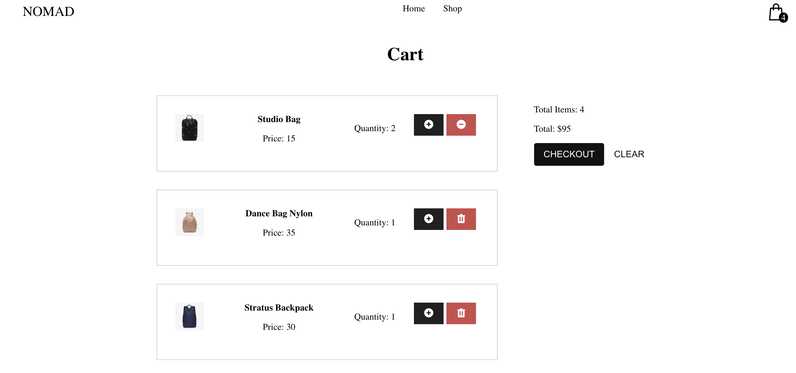

Add some items to the cart and then test the increase, decrease, remove and the clear cart functionality. This completes our cart functionality. 

However, there is one slight issue, when we refresh the page our cart items are lost, that's because this data is not persisted anywhere. 

To solve this issue we can make use of the local storage API available in the browser to save our cart and make it available even if the user refreshes the page. 

### Persist cart data with local storage

To persist our cart items using local storage, we're going to save the items at certain points. Inside the cart context, we're going to do a check first to see if there is an item `cart` already available in local storage. If this item has already been saved, we're going to use that else we're going to set an empty array: 

```javascript
// cart-context.js
import React, { createContext, useReducer } from 'react';
//highlight-next-line
import cartReducer, { sumItems } from './cart-reducer';
import types from '../types';

export const CartContext = createContext();
//highlight-start
const cartFromStorage = localStorage.getItem('cart') ? JSON.parse(localStorage.getItem('cart')) : [];
const initialState = { cartItems: cartFromStorage, ...sumItems(cartFromStorage) };
//highlight-end
```

We've also imported the `sumItems` function and we're going to pass it the items from the storage. Now the next place we're going to save our cart data is whenever the items are updated, for this we're always calling the `sumItems` function. 

This makes it a perfect place to perisist on each update. So inside the `sumItems` function we're going to make a save to the cart items onto local storage using a helper function: 

```javascript
// cart-reducer.js
//highlight-start
const storeCartItems = (cartItems) => {
  localStorage.setItem('cart', JSON.stringify(cartItems.length > 0 ? cartItems: []));
}
//highlight-end

export const sumItems = cartItems => {
  //highlight-next-line
  storeCartItems(cartItems);
  return { 
    itemCount: cartItems.reduce((total, product) => total + product.quantity, 0), 
    total: cartItems.reduce((total, product) => total + product.price * product.quantity, 0), 
  }
}
```

Finally, we need a way of clearing the items from the local storage when the user has checked out or clicked the clear cart button. For this we're going to update the 'CLEAR' case inside the cart reducer function to remove the cart items: 

```javascript
// cart-reducer.js
 //...
 case types.CLEAR:
   //highlight-next-line
  localStorage.removeItem('cart'); // remove the 'cart' item from local storage
  return {
    cartItems: [],
    itemCount: 0,
    total: 0,
  }  
```

Now when we add items to the cart and refresh the page our cart items are no longer lost.

We now have a fully functional React cart app that let's us add, remove, increase, decrease and clear the cart. We're also making use of the browser local storage API to persist our cart items until the user checks out or clears the cart. 

I hope you enjoyed this step-by-step tutorial, in an upcoming post we're going to use this React ecommerce app and add Stripe to accepts payments. If you would like learn how to integrate a Stripe - I have a full Stripe Masterclass course, you can get more details here: <a href="https://www.udemy.com/course/stripe-masterclass-with-react-node/?couponCode=F1AE8F3CFDCA5F79DCE6" target="_blank">Stripe Masterclass Course</a>